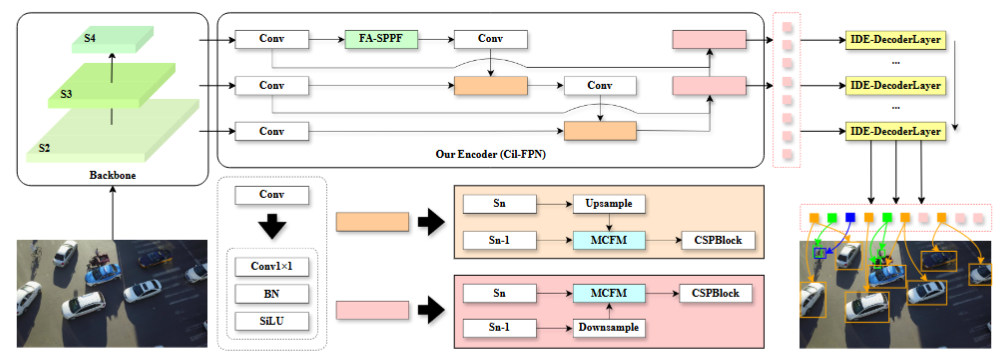
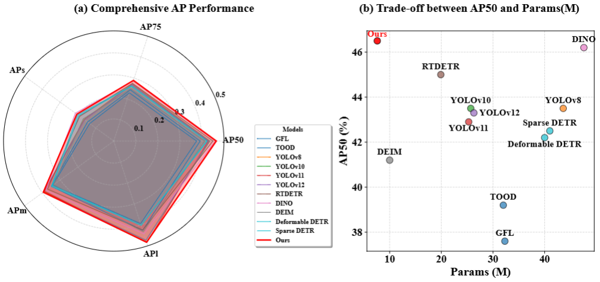

⚠️ The complete code will be released after acceptance.

#
****
It introduces DroneDEIM, a novel detection framework for UAV object detection, addressing extreme density and tiny objects.

## Abstract

## Contributions
